# Business-Analysis

## Overview

An anonymous business has shared its sales data (2017-2019) on the website Kaggle. The goal of this project is to determine trends in the data. More specifically, the goal is to determine the following:

* Are sales increasing? 
* What products are selling the most?
* What products are selling the least? 
* What products produce the highest revenue per sale?
* Do higher discounts result in more products sold? What about total net sales? 
* What time of the year has the highest sales?
* If the company needed to improve profits by discountinuing one of their product lines, which product type should be chosen?

To answer these questions, Python and Jupyter Notebook were used, along with Pandas and Matplotlib. 

## Results

As seen in the bar graph below, the most frequently bought products are baskets, art & sculpture and jewelry. The least bought items are One-of-a-kind, textiles and furniture. As expected, most of the discounts and returns are derived from baskets, art & sculpture and jewelry. 

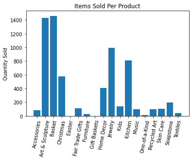
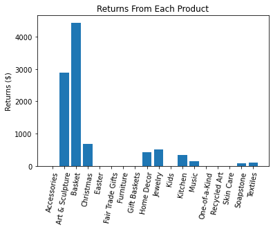
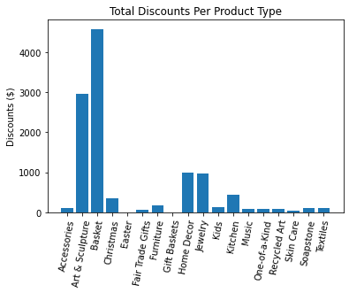

However, when it comes to percent return, textiles have much higher returns on average, and Easter and furniture products have the highest percent discounts.

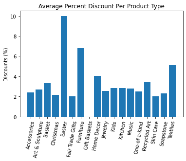
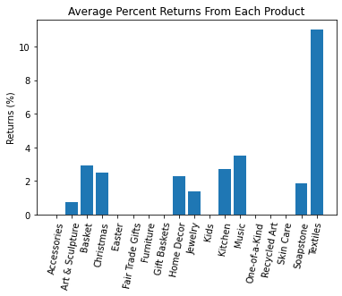 

The following bar chart shows the revenue made per product item. One-of-a-kind products, though sold infrequently, make the most revenue for each item sold. In second place is baskets, and furniture in third. It is advised to continue to offer "One-of-a-kind" products due to it's potential for boosting revenue.

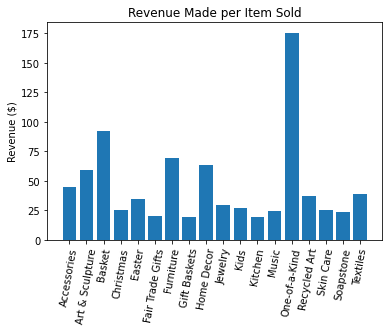 

The next bar chart shows the total sales of each product. As expected, baskets and art & sculpture are the largest. All other products are small in comparison. Given that textiles has such a low profit margin with a high return rate, textile would be the product to discountinue. The next choices would be Easter and gift baskets due to their extremely small sales.  

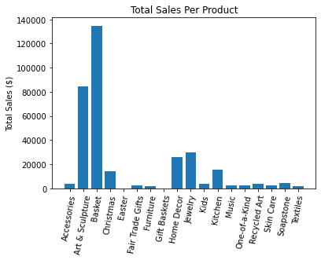

### Time Analysis

The figure below plots the average net loss per month. In this project, we have defined net worth as the amount of the gross sales lost from discounts and returns. The figure shows no clear patterns. However, there seems to be a large spike in net loss during the beginning months of 2017 and 2019. Each large spike in discounts appears to be spaced by several months of low net loss.

The next pair of figures shows the amount of monthly discounts and returns overtime. The amount of discounts skyrockets near the end of 2019, but is stable otherwise. Thus, the fluctuation in net loss is due to returns, which is demonstrated in the second figure.

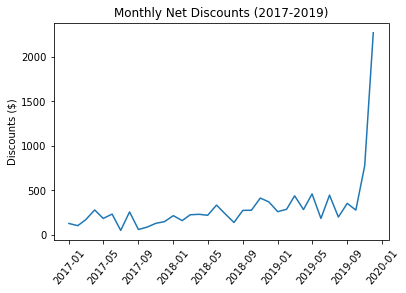
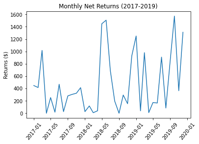

From the large amount of overlap in the plot below, it is evident that the  majority of the money loss came from returns and not discounts. There was a huge spike in net loss and returns in the early summer of 2018. There were also many order occuring that month, which would explain the sudden increase in returns.

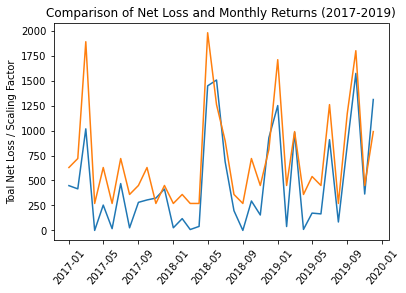

Annual sales are increasing. The percent increase from 2017 to 2019 is roughly 50%. This is fantastic new for the company! From the line plot, it seems that the sales always jump during the end of the year, which right around Christmas season. 

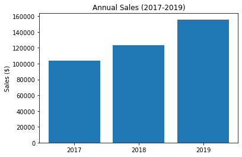
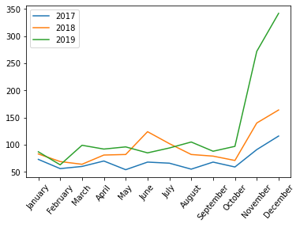

A linear regression analysis was performed on the monthly net sales from 2017 to 2019. From the slope of the equation, net sales increase by $243 every month that goes by. The r value is around 0.47, which means this equation fits the data moderately well. The p value is well below 0.05, so this linear trend is unlikely to be due to chance. 

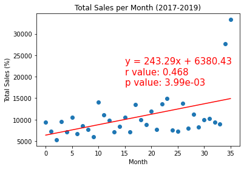

The % montly return was plotted and fitted with a regression line. The p value is roughly 0.28, which is too high to be statistically significant. As a result, the weak relationship between % return and time that is shown in the plot cannot be verified. Thus, as the company sells more products, the amount of money lost from returns is proportional. The comapny has worked hard to keep its services at a consistent quality! 
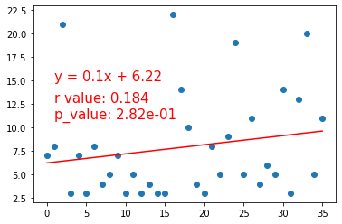

Lastly, scatter plots were created to determine if an increase in % Discount translated to more sales. It is evident that the quantity of items sold increases with % discount until quanity sold reaches a maximum at 2.5-3% discount. Beyond 10%, the quantity sold is practically 0. A similar, though weaker, trend is found with net sales and % discount. Therefore, it is reccomended to keep discounts between 0 and 10% to maximize sales, preferrably near 2-3%.

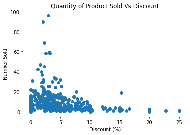 
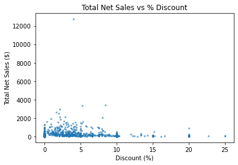 

## Conclusion

From 2017-2019, the most commonly bought products were baskets, art & sculpture and jewelry. The late fall and early winter months show the most profit, which is right around Christmas season. The product that produced the most revenue per item sold was the "One-of-a-kind" product line, which is one of the least sold items. Baskets came in second place for most revenue per item sold, and is the most popular product currently. 

The company entered a unusually profitable quarter during the winter months of 2019, all without an increase in the % returns. From the scatter plots above, it is recomended that the company continue to place discounts on products, but keep them near or below 10%. 

Due to the low profit margin and high return rate of textiles, this product would be the best product type to discountinue. Next in line would be Easter and gift baskets, the latter of which could simply be merged with the more popular baskets category. 

The company is predicted to continue increasing their sales, with an esitmated $240 increase per month. The company has made a lot of progress and should have a bright future ahead of itself.
